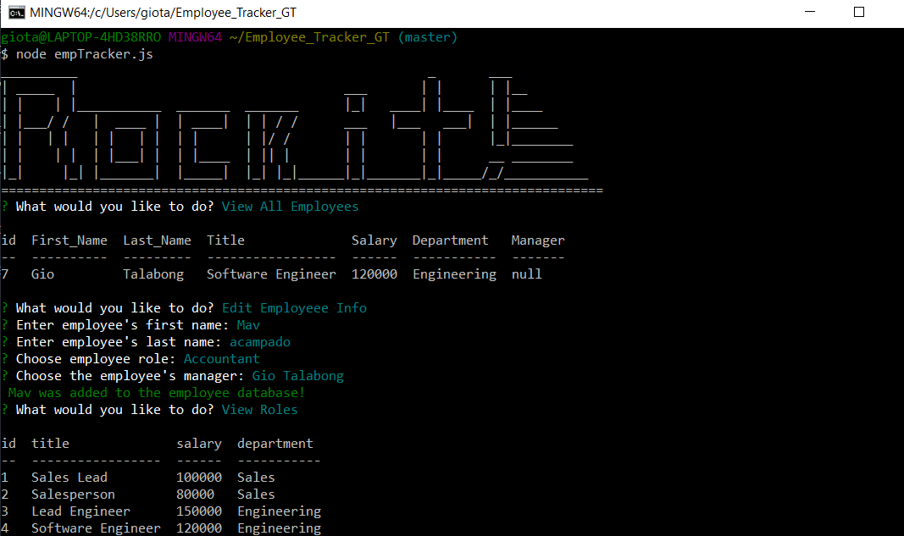

# Employee_Tracker_GT
# Unit 12 MySQL Homework: Employee Tracker

Developers are often tasked with creating interfaces that make it easy for non-developers to view and interact with information stored in databases. Often these interfaces are known as **C**ontent **M**anagement **S**ystems. In this homework assignment, your challenge is to architect and build a solution for managing a company's employees using node, inquirer, and MySQL.

## what's in the app

Design the following database schema containing three tables:


* **department**:

  * **id** - INT PRIMARY KEY
  * **name** - VARCHAR(30) to hold department name

* **role**:

  * **id** - INT PRIMARY KEY
  * **title** -  VARCHAR(30) to hold role title
  * **salary** -  DECIMAL to hold role salary
  * **department_id** -  INT to hold reference to department role belongs to

* **employee**:

  * **id** - INT PRIMARY KEY
  * **first_name** - VARCHAR(30) to hold employee first name
  * **last_name** - VARCHAR(30) to hold employee last name
  * **role_id** - INT to hold reference to role employee has
  * **manager_id** - INT to hold reference to another employee that manager of the current employee. This field may be null if the employee has no manager
  
Build a command-line application that at a minimum allows the user to:

  * Add departments, roles, employees

  * View departments, roles, employees

  * Update employee roles

Bonus points if you're able to:

  * Update employee managers

  * View employees by manager

  * Delete departments, roles, and employees

  * View the total utilized budget of a department -- ie the combined salaries of all employees in that department

We can frame this challenge as follows:

```
As a business owner
I want to be able to view and manage the departments, roles, and employees in my company
So that I can organize and plan my business
```


### Hints

* You may wish to include a `seed.sql` file to pre-populate your database. This will make development of individual features much easier.

* Focus on getting the basic functionality completed before working on more advanced features.

* Review the week's activities for a refresher on MySQL.

* Check out [SQL Bolt](https://sqlbolt.com/) for some extra MySQL help.

## Minimum Requirements

* Functional application.

* GitHub repository with a unique name and a README describing the project.

* The command-line application should allow users to:

  * Add departments, roles, employees

  * View departments, roles, employees

  * Update employee roles

## Updates
* The command-line application should allow users to:

  * Update employee managers

  * View employees by manager

  * Delete departments, roles, and employees

  * View the total utilized budget of a department -- ie the combined salaries of all employees in that department

## Notes to myself

One of the most important skills to master as a web developer is version control. Building the habit of committing via Git is important for two reasons:

* Your commit history is a signal to employers that you are actively working on projects and learning new skills.

* Your commit history allows you to revert your codebase in the event that you need to return to a previous state.

Follow these guidelines for committing:

* Make single-purpose commits for related changes to ensure a clean, manageable history. If you are fixing two issues, make two commits.

* Write descriptive, meaningful commit messages so that you and anyone else looking at your repository can easily understand its history.

* Don't commit half-done work, for the sake of your collaborators (and your future self!).

* Test your application before you commit to ensure functionality at every step in the development process.

We would like you to have well over 200 commits by graduation, so commit early and often!
## Programs used
Javascript
  * mysql
  * inquirer
  * console.table


## links and photo

(https://drive.google.com/file/d/1T3ijF-ImzPgdD9SHERJjOsymgzv5toLZ/view)
